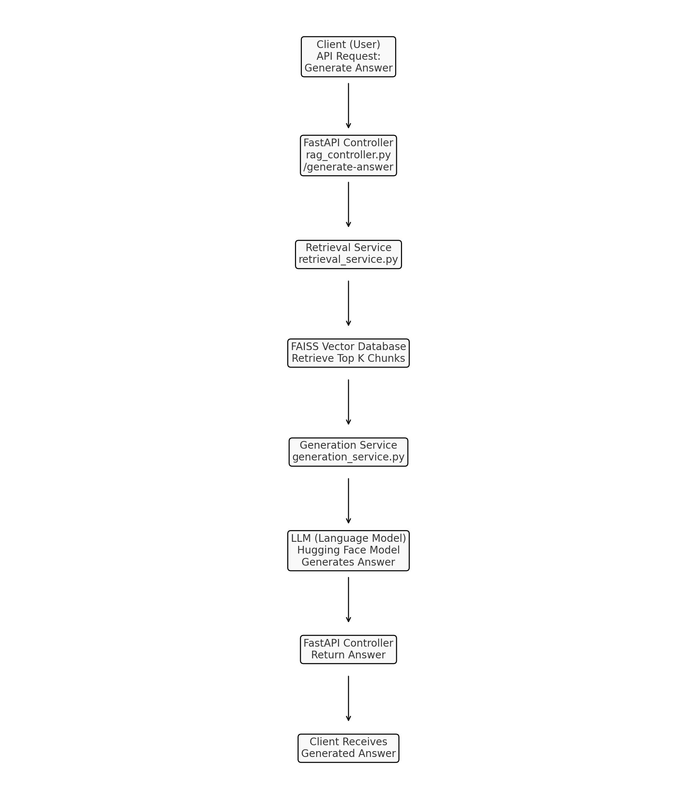

# FastAPI Retrieval-Augmented Generation (RAG) Pipeline

This project implements a Retrieval-Augmented Generation (RAG) pipeline using FastAPI, FAISS for retrieval, and a Hugging Face language model for response generation. The RAG pipeline combines the retrieval of relevant document chunks and generation of answers using a language model.

## Project Structure

```plaintext
rag_fastapi_project/
├── app/
│   ├── controllers/
│   │   └── rag_controller.py       # Handles API endpoints
│   ├── services/
│   │   ├── retrieval_service.py    # Handles FAISS retrieval
│   │   ├── indexing_service.py     # Indexes and updates FAISS
│   │   └── generation_service.py   # Generates response (using a model if needed)
│   ├── repository/
│   │   └── data_repository.py      # Loads, preprocesses, and saves data and FAISS index
│   ├── documents/
│   │   ├── gal.csv
│   │   └── ATCDPP.csv 
│   └── main.py                     # FastAPI entry point
└── requirements.txt                # Required packages
```

## Workflow Overview

1. **Client sends a question** via the `/generate-answer` endpoint.
2. **Retrieval Service**: Uses FAISS to retrieve relevant document chunks based on the question.
3. **Generation Service**: Combines retrieved document chunks as context and generates an answer using a language model from Hugging Face.
4. **Return to Client**: The generated answer is returned to the client.

## Flowchart

The flowchart below illustrates the end-to-end pipeline.



## Components

- **Data Repository**: Loads, preprocesses, vectorizes, and indexes data using FAISS and TF-IDF.
- **Retrieval Service**: Retrieves relevant chunks using vector similarity search.
- **Generation Service**: Uses a language model to generate responses based on retrieved context.
- **Controller**: Manages API endpoints and coordinates retrieval and generation.

## How to Run

1. **Install dependencies**:
   ```bash
   pip install -r requirements.txt
   ```

2. **Run the FastAPI server**:
   ```bash
   uvicorn app.main:app --reload
   ```

3. **API Endpoint**:

   - `POST /generate-answer`: Takes a question as input and returns a generated answer based on the documents in the FAISS index.

## Example API Request

Send a POST request to `http://127.0.0.1:8000/generate-answer` with a JSON payload containing the question:

```json
{
  "question": "What are the symptoms of diabetes?"
}
```

## Technologies Used

- **FastAPI**: For building the API endpoints.
- **FAISS**: For efficient similarity search and retrieval.
- **Hugging Face Transformers**: For language model integration to generate answers.
- **pandas, sklearn, nltk**: For data processing and text vectorization.

## Additional Information

- **Flow Control**: The `DataRepository` class manages data loading and indexing, while the `RetrievalService` and `GenerationService` handle document retrieval and answer generation, respectively.
- **Execution Policies**: If using PowerShell, you may need to set execution policies to allow script activation with virtual environments.
